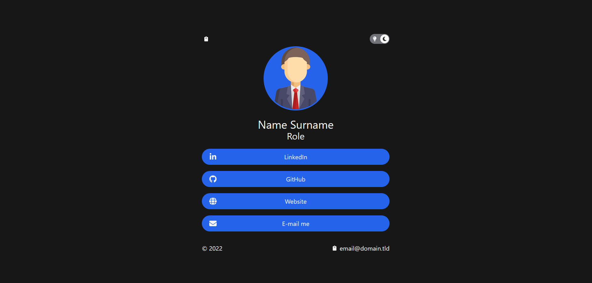
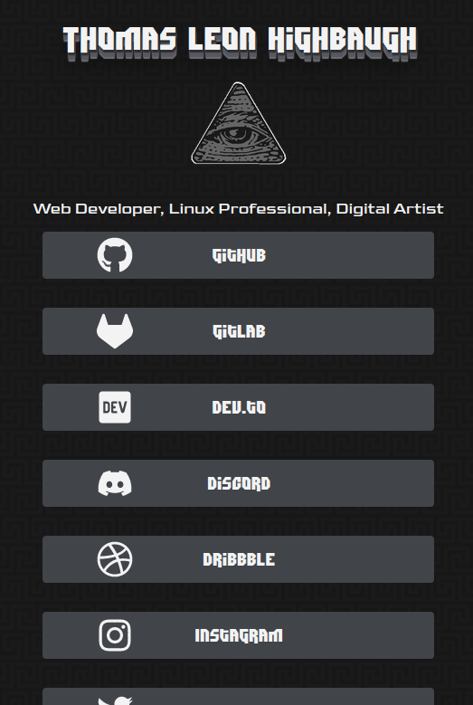

# Biolink

> responsive design!

A responsive linktree alternative, written in `tsx` with `next.js` & `tailwind.css` to ease the process of ennumerating my various social media & art-related accounts. 

## Technologies Employed 

- `next.js` - static site generator that makes for fast loading on the client side
- `tailwind.css` - allowing powerful and consistent styling within the `.tsx` files (as class attributes) 
- `tsx` - React in Typescript, the primary programming language
- `heropatterns` - svg background pattern 

